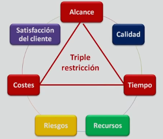

## Conceptos basicos
### PMI `Project Management Institute`
- Organizacion sin fines de lucro.
- Buenas practicas para la direccion de proyectos.
- Guia `PMBOK`.
- 42 procesos clasificados en 9 areas del conocimiento y 5 grupos de proceso.

### PMP `Project Management Professional`
- Certificacion ofrecida por el `pmi`.
- 3 a 5 años de experiencia en gestion de proyectos.
- 35 horas de formacion relacionadas con la gestion de proyectos.
- Aprobacion del examen escrito.

### PMBOK `Project Management Body of Knowledge`
- Guia de los fundamentos de la gestion de proyectos.
- Presenta un conjunto de estandares, conocimientos, habilidades, herramientas, técnicas, pautas y normas para la gestion de proyectos.

### Proyecto
- Esfuerzo planificado, temporal y unico para la creacion de un `resultado unico` | `entregable` que agreguen valor o causen un cambio retroactivo.
- Suger de una necesidad `caso de negocio`.
- La cualidad temporal del proyecto, no se aplica al `resultado unico`, porque puede tener una gran longevidad.
- Esta completo cuando los objetivos han sido alcanzados.

### Caso de negocio
- Genera un proyecto.
- Maneja un analisis del costo - beneficio, para la su justificacion y limites del proyecto.
- Determina si el proyecto es viable o no en terminos de la inversion requerida.
- Asegura que el proyecto sigue orientado o alineado hacia el logro de los beneficios de negocio.
- El sponsor debe estar deacuerdo con el alcance y limitaciones de este.
- De crea como resultado de:
 - Demanda u oportunidad del mercado.
 - Necesidad de la organizacion.
 - Solicitud de un cliente.
 - Avance tecnologico.
 - Requisito legal.
 - Impacto ecologico.
 - Necesidad social.

### Grupos de procesos de la direccion de proyectos
1. [Grupos de procesos de inicializacion.](grupos-de-procesos/grupos-de-procesos-de-inicializacion.md)
2. [Grupos de procesos de planificacion.](grupos-de-procesos/grupos-de-procesos-de-planificacion.md)
3. [Grupos de procesos de ejecucion.](grupos-de-procesos/grupos-de-procesos-de-ejecucion.md)
4. [Grupos de procesos de monitoreo y control.](grupos-de-procesos/grupos-de-procesos-de-monitoreo-y-control.md)
5. [Grupos de procesos de cierre.](grupos-de-procesos/grupos-de-procesos-de-cierre.md)

### Areas del conocimiento
- [Gestion de la integracion.](areas-del-conocimiento/gestion-de-la-integracion.md)
- [Gestion del alcance.](areas-del-conocimiento/gestion-del-alcance.md)
- [Gestion del tiempo.](areas-del-conocimiento/gestion-del-tiempo.md)
- [Gestion de los costos.](areas-del-conocimiento/gestion-de-los-costos.md)
- [Gestion de la calidad.](areas-del-conocimiento/gestion-de-la-calidad.md)
- [Gestion de los recursos humanos.](areas-del-conocimiento/gestion-de-los-recursos-humanos.md)
- [Gestion de la comunicacion.](areas-del-conocimiento/gestion-de-la-comunicacion.md)
- [Gestion de los riesgos.](areas-del-conocimiento/gestion-de-los-riesgos.md)
- [Gestion de la adquisicion.](areas-del-conocimiento/gestion-de-la-adquisicion.md)
- [Gestion de los interesados.](areas-del-conocimiento/gestion-de-los-interesados.md)

### Producto
- Opcion elegible, viable y repetible.
- Satisface una necesidad.
- Se consume y se desgasta.
- Articulo, documento, componente.

### Servicio
- Conjunto de actividades que satisfacen una necesidad
- Es intangible.

### Entregable `Resultado único`
 - Es un producto o servicio.
 - Es unico y verificable `¿es conforme a lo acordado?` | `¿esta completo?`.
 - Es producido al terminar un proceso, fase o un proyecto.
 - Son componentes completados para alcanzar los objetivos del proyecto.
 - Pueden incluir elementos del plan para la direccion del proyecto.
 - Puede ser tangible o intangible.
 - Puede ser un reporte, documento, paquete de trabajo, una actualizacion de servidor o cualquier otro bloque de construccion.
 - Puede estar compuesto de multiples entregables.
 - Puede ser el componente de otro elemento.
 - Puede ser una mejora de un elemento.
 - Puede ser una conclusion a una investigacion.
 - Es unico:
  - Es un resultado diferente que permite ser tratado de distintas maneras, en distintos proyectos.
  - Pueden existir elementos repetitivos entre algunos entregables y actividades del proyecto, esta repeticion no altera las caracteristicas fundamentales y unicas del trabajo del proyecto.
  - Pueden ser construidos por herramientas, materiales y recursos identicos o similares, cada proyecto en su construccion es unico, puede tener un lugar, diseño, interesados, circunstancia y situaciones diferentes.

### Sponsor `Patrocinador`
- Establece cuando el proyecto se inicia o se detiene.
- Impone objetivos.
- Lidera al gestor de proyecto.
- Se encarga del financiamiento.

### Objectivos `Requisitos`
- Extraidos de los interesados.
- Registrados en el `acta de constitucion`.
- Si se identifica que no pueden ser cumplidos, se requerira una redefinicion o adecuacion, para su alcance.
- Tienen que ser medibles, para conocer su progreso o si estan alcanzados.
- Tienen que ser claros, no ambiguos, faciles de entender.
- Tienen que ser realizar, para hacer posible su alzance
- Su modificacion puede generar riesgos adicionales
- Su cumplimiento satisface
 - Las necesidades, inquietudes y expectativas de los interesados
 - Equilibra las restricciones contrapuestas relativas al alcance, cronograma, presupuesto, calidad, recursos y riesgos para la produccion del resultado unico.

### Esfuerzo temporal
- Es un periodo o intervalo de tiempo.
- Empieza `fecha inicio` y finaliza `fecha fin`.
- El final se alcanza cuando:
  - Se logran los objetivos.
  - Los objetivos no se pueden cumplir.
  - Ya no existe la necesidad que lo origino.
  - Si el cliente desea terminar el proyecto.

### Dirección de proyectos `Gestion de proyectos`
- Aplicación del `pmbok` a las actividades de un proyecto, para cumplir los objetivos del proyecto.
- Incluye la identificacion de requisitos.
- Satisfaccion de los interesados en la planificacion y ejecucion.
- Establecer, mantener y realizar comunicaciones activas, eficaces y de naturaleza colaborativas entre los interesados.
- Gestionar a los interesados para el cumplimiento y entrega de los objetivos del proyecto.
- Responsable de hacer cumplir los objetivos del proyecto.
- Debe ser capaz de equilibrar las limitaciones o restricciones del proyecto: alcance, calidad, tiempo / cronograma, riesgos, recursos, costos / presupuesto y satisfacción del cliente, para cumplir con los objetivos del proyecto.
 - Debido a que estan conectadas, por lo tanto si se modifican o alteran una de estas, las demás pueden ser influenciadas / afectadas ej:
  - [- tiempo]  -> [+ costos]
  - [- calidad] -> [- costos] + [- tiempo] + [-satisfacción del cliente]
   
 - Las caracteristicas especificas del proyecto y las circunstancias pueden influir sobre las restricciones.

- Dado el potencial de cambios, el desarrollo del plan para la dirección del proyecto es una actividad iterativa
y su elaboración es progresiva a lo largo del ciclo de vida del proyecto. La elaboración progresiva implica
mejorar y detallar el plan de manera continua, a medida que se cuenta con información más detallada y
específica, y con estimaciones más precisas. La elaboración progresiva permite al equipo de dirección del
proyecto definir el trabajo y gestionarlo con un mayor nivel de detalle a medida que el proyecto va avanzando.
