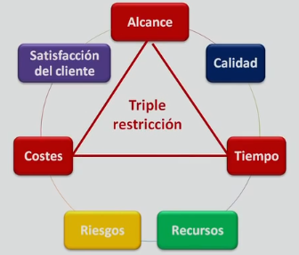

## Conceptos basicos
### PMI `Project Management Institute`
- Organizacion sin fines de lucro.
- Buenas practicas para la direccion de proyectos.
- Guia `PMBOK`.
- 42 procesos clasificados en 9 areas del conocimiento y 5 grupos de proceso.

### PMP `Project Management Professional`
- Certificacion ofrecida por el `pmi`.
- 3 a 5 años de experiencia en gestion de proyectos.
- 35 horas de formacion relacionadas con la gestion de proyectos.
- Aprobacion del examen escrito.

### PMBOK `Project Management Body of Knowledge`
- Guia de los fundamentos de la gestion de proyectos.
- Presenta un conjunto de estandares, conocimientos, habilidades, herramientas, técnicas, pautas y normas para la gestion de proyectos.

### PMO `Project Management Office`
- Oficina de direccion de proyectos.
- Es un departamento o estrucura organizativa.
- Forma parte de la estructura general de la organizacion que dirige proyectos.
- Ofrece soporte a los directores de proyecto de la organizacion.
- Facilita el uso de herramientas, metodologias y recursos.
- Realiza un analisis y despliegue de los resultados (mejores practicas y lecciones aprendidas) de proyectos culminados.
- Es la estructura de gestion para estandarizar los procesos de gobierno de los proyectos (crea estandares).
- Puede que el equipo de proyecto dependa directamente del `director de proyecto` o de la `PMO` si son compartidos.
- Tiene cabida en cualquier estructura organizativa.

- Direccion organizacional de proyectos OPM
 - Es un marco para la ejecucion de estrategias a traves de la direccion de proyectos, programas y portafolios
 - Conjunto de practicas organizativas, estrategias organizacionales capaces de producir un mejor desempeño, resultado y ventaja competitiva.
- Potencia la capacidad de la organizacion para la consecucion de los objetivos estrategicos mediante
 - Vinculacion de los principios y practicas de la direccion de proyectos, programas y portafolios con los facilitadores de la organizacion (ej: practicas estructurales, culturales, tecnologicas y de recursos humanos)
 - Una organizacion mide sus capacidades para posteriormente planificar e implementar mejoras enfocandose en las mejores practicas.

### Producto
 - Opcion elegible, viable y repetible.
 - Satisface una necesidad.
 - Se consume y se desgasta.
 - Articulo, documento, componente.

### Servicio
 - Conjunto de actividades que satisfacen una necesidad
 - Es intangible.

### Esfuerzo temporal
 - Es un periodo o intervalo de tiempo.
 - Empieza `fecha inicio` y finaliza `fecha fin`.
 - El final se alcanza cuando:
   - Se logran los objetivos.
   - Los objetivos no se pueden cumplir.
   - Ya no existe la necesidad que lo origino.
   - Si el cliente desea terminar el proyecto.

### Entregable `Resultado único`
  - Es un producto o servicio.
  - Es unico y verificable `¿es conforme a lo acordado?` | `¿esta completo?`.
  - Es producido al terminar un proceso, fase o un proyecto.
  - Son componentes completados para alcanzar los objetivos del proyecto.
  - Pueden incluir elementos del plan para la direccion del proyecto.
  - Puede ser tangible o intangible.
  - Puede ser un reporte, documento, paquete de trabajo, una actualizacion de servidor o cualquier otro bloque de construccion.
  - Puede estar compuesto de multiples entregables.
  - Puede ser el componente de otro elemento.
  - Puede ser una mejora de un elemento.
  - Puede ser una conclusion a una investigacion.
  - Es unico:
   - Es un resultado diferente que permite ser tratado de distintas maneras, en distintos proyectos.
   - Pueden existir elementos repetitivos entre algunos entregables y actividades del proyecto, esta repeticion no altera las caracteristicas fundamentales y unicas del trabajo del proyecto.
   - Pueden ser construidos por herramientas, materiales y recursos identicos o similares, cada proyecto en su construccion es unico, puede tener un lugar, diseño, interesados, circunstancia y situaciones diferentes.

### Objectivos `Requisitos`
 - Extraidos de los interesados.
 - Registrados en el `acta de constitucion`.
 - Si se identifica que no pueden ser cumplidos, se requerira una redefinicion o adecuacion, para su alcance.
 - Tienen que ser medibles, para conocer o constrastar su progreso o si estan alcanzados.
 - Tienen que ser claros, no ambiguos, faciles de entender.
 - Tienen que ser posibles de realizar, para hacer posible su alcance.
 - Su modificacion puede generar riesgos adicionales
 - Su cumplimiento satisface
  - Las necesidades, inquietudes y expectativas de los interesados
  - Equilibra las restricciones contrapuestas relativas al alcance, cronograma, presupuesto, calidad, recursos y riesgos para la produccion del resultado unico.

### Portafolio
- Grupos de proyectos, programas, subconjunto de portafolios y operaciones gestionadas que se agrupan para **facilitar su gestion** con objeto de alcanzar los objetivos estrategicos del negocio.
- Los proyectos o programas del portafolio **no son necesariamente interdependientes** ni estan necesariamente relacionados de manera directa.

### Direccion de portafolio
- **Gestion centralizada de uno o mas portafolios** con objeto de alcanzar los objetivos estrategicos.
- Se asegura que los programas y proyectos se revisen a fin de **establecer las prioridades para la asignacion de recursos** y el trabajo a realizar.
- Se alinea con las estrategias organizacionales mediante la **seleccion de programas o proyectos**.

### Programa
- La **gestion conjunta y coordinada** de proyectos relacionados, subprogramas y actividades de programas, se obtiene un mejor control y beneficio en conjunto que individualmente.
- Un programa siempre consta de proyectos.
- Un proyecto puede o no formar parte.
- Puede incluir elementos de trabajo relacionados que no forman parte de proyectos.
- Se relacionan por un **resultado comun o de la capacidad colectiva**.
- Si la relacion es por un clientes, vendedor, tecnologia o recurso en comun, deberia ser un portafolio.

### Direccion de programa
- **Aplicación del `pmbok`** a un programa para cumplir sus objetivos, obtener beneficios y control que no seria posible de forma individual.
- Se enfoca en la **interdependencias entre los proyectos**.
- Acciones relacionadas con las interdependencias:
 - **Resolver restricciones y/o conflictos** que afectan a multiples proyectos del programa.
 - **Alinear la direccion de la organizacion y/o estrategia** que afecta las metas y los objetivos de proyectos y del programa.
 - **Resolver la gestion de incidentes y cambios** dentro de una estructura de gobernabilidad compartida.
- Enfocandose en los beneficios
 - Adecua sus proyectos y componentes de programas
 - Controla las interdependencias.

### Proyecto
 - Esfuerzo planificado, temporal y unico para la creacion de un `resultado unico` | `entregable` que agreguen valor o causen un cambio retroactivo.
 - Suger de una necesidad `caso de negocio`.
 - La cualidad temporal del proyecto, no se aplica al `resultado unico`, porque puede tener una gran longevidad.
 - Esta completo cuando los objetivos han sido alcanzados.

### Direccion de proyecto `Gestion de proyecto`
- **Aplicación del `pmbok`** a las actividades de un proyecto, para cumplir los objetivos del proyecto.
- **Desarrolla e implementa planes** para lograr un alcance determinado, apuntando a los objetivos del programa, portafolio y estrategias organizacionales.
- Incluye la **identificacion de requisitos**.
- Cumplimiento de los objetivos, para la **satisfaccion de los interesados** en la planificacion y ejecucion.
- Establecer, mantener y realizar **comunicaciones** activas, eficaces y de naturaleza colaborativas entre los interesados.
- **Gestionar a los interesados** para cumplir los requisitos del proyecto.
- Responsable de **hacer cumplir los objetivos del proyecto**.
- Debe ser capaz de **establecer correctamente los objetivos** o requisitos para el cumplimiento del proyecto.
- Debe ser capaz de **equilibrar las limitaciones o restricciones del proyecto**:
 - El alcance.
 - La calidad.
 - El tiempo o el cronograma.
 - Los costos o el presupuesto.
 - Los riesgos.
 - Los recursos.
 - La satisfacción del cliente.
- Para cumplir con los objetivos del proyecto.
- Debido a que estan conectadas, por lo tanto si se modifican, alteran o cambian uno de estos, las demás pueden ser influenciados o afectados ej:
 - [- tiempo]  -> [+ costos].
 - [- calidad] -> [- costos] + [- tiempo] + [-satisfacción del cliente].

  

- Las caracteristicas y circunstancias especificas del proyecto pueden influir sobre las restricciones o limitaciones.
- Debido a su dependencia, **las limitaciones deben ser equilibradas con los interesados**, para que no se vean afectados unos mas que otros.
- El desarrollo del plan para la direccion del proyecto es una **actividad iterativa y su elaboracion es progresiva** (mayor detalle, especificacion del plan y precision en las estimaciones) a lo largo de su ciclo de vida del proyecto.

### Caso de negocio
- Son el medio para alcanzar directa o indirectamente los objetivos recogidos en el plan estrategico de la organizacion.
- Genera un proyecto.
- Maneja un analisis del costo - beneficio, para la su justificacion y limites del proyecto.
- Determina si el proyecto es viable o no en terminos de la inversion requerida.
- Asegura que el proyecto sigue orientado o alineado hacia el logro de los beneficios de negocio.
- El sponsor debe estar deacuerdo con el alcance y limitaciones de este.
- Se crea como resultado de:
 - **Demanda u oportunidad del mercado** ( *de mercado* ).
 - **Necesidad u oportunidad estrategica de la organizacion o negocio** ( *de negocio u organizacion* ).
 - **Solicitud de un cliente** ( *que afecta a un cliente del negocio u organizacion* ).
 - **Avance tecnologico** ( *que afecta a la tecnologia* ).
 - **Requisito legal** ( *que tiene un efecto legal* ).
 - **Impacto ecologico o consideraciones ambientales** ( *que afecta al medio ambiente* ).
 - **Necesidad social** ( *que afecta a la sociedad* ).
- ( ... ) en respuesta a una situacion, suceso, incidente, evento, acontecimiento o problema ...

### Grupos de procesos de la direccion de proyectos
1. [Grupos de procesos de inicializacion.](grupos-de-procesos/grupos-de-procesos-de-inicializacion.md)
2. [Grupos de procesos de planificacion.](grupos-de-procesos/grupos-de-procesos-de-planificacion.md)
3. [Grupos de procesos de ejecucion.](grupos-de-procesos/grupos-de-procesos-de-ejecucion.md)
4. [Grupos de procesos de monitoreo y control.](grupos-de-procesos/grupos-de-procesos-de-monitoreo-y-control.md)
5. [Grupos de procesos de cierre.](grupos-de-procesos/grupos-de-procesos-de-cierre.md)

### Areas del conocimiento
- [Gestion de la integracion.](areas-del-conocimiento/gestion-de-la-integracion.md)
- [Gestion del alcance.](areas-del-conocimiento/gestion-del-alcance.md)
- [Gestion del tiempo.](areas-del-conocimiento/gestion-del-tiempo.md)
- [Gestion de los costos.](areas-del-conocimiento/gestion-de-los-costos.md)
- [Gestion de la calidad.](areas-del-conocimiento/gestion-de-la-calidad.md)
- [Gestion de los recursos humanos.](areas-del-conocimiento/gestion-de-los-recursos-humanos.md)
- [Gestion de la comunicacion.](areas-del-conocimiento/gestion-de-la-comunicacion.md)
- [Gestion de los riesgos.](areas-del-conocimiento/gestion-de-los-riesgos.md)
- [Gestion de la adquisicion.](areas-del-conocimiento/gestion-de-la-adquisicion.md)
- [Gestion de los interesados.](areas-del-conocimiento/gestion-de-los-interesados.md)

### Sponsor `Patrocinador`
- Establece cuando el proyecto se inicia o se detiene.
- Impone objetivos.
- Lidera al gestor de proyecto.
- Se encarga del financiamiento.

--- proyectos y planificacion estrategica
